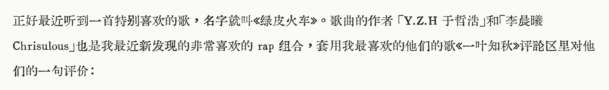
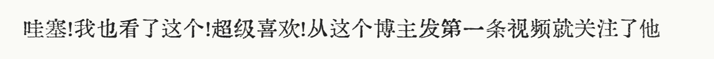
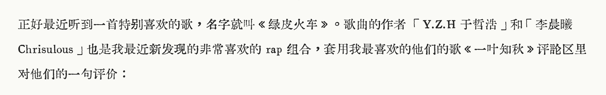

# 汇文明朝体（修正）

原字体在知乎上发布：https://zhuanlan.zhihu.com/p/344103391

但是原字体的一些中文符号，例如 “！”、“？”、“《》” 等，宽度并不是全角字符（占一个汉字宽度），观感较差，如下：

因此修正了一些常用符号的宽度，使之符合中文全角字符宽度，符号作居中处理。

修正效果如下：

目前已经修正的符号如下：

|符号|名称|unicode 编号|
|:-:|:-:|:-:|
|《|左双书名号|300A|
|》|右双书名号|330B|
|「|中式单开引号|300C|
|」|中式单关引号|300D|
|『|中式双开引号|300E|
|』|中式双关引号|300F|
|！|感叹号|FF01|
|（|左括号|FF08|
|）|右括号|FF09|
|：|冒号|FF1A|
|；|分号|FF1B|
|？|问号|FF1F|

目前仅修正了我所用到的符号，后续慢慢考虑修正所有的符号，以及优化符号的位置，而不只是居中处理。

